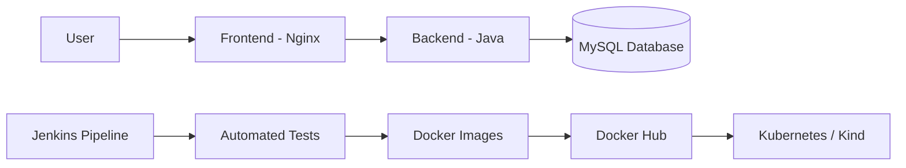

# Three-Tier DevOps Project

A containerized three-tier employee application demonstrating CI/CD automation, Docker, Kubernetes deployment, and AWS-ready infrastructure practices.

This project was tested in local Kubernetes/Kind and AWS-based environments. The checked-in Jenkins pipeline currently uses a Kind cluster for deployment.

## Architecture



## Technology Stack

| Area | Technologies |
|---|---|
| Backend | Java, Maven |
| Frontend | HTML, Nginx |
| Database | MySQL |
| Containers | Docker, Docker Compose |
| Orchestration | Kubernetes, Kind, kubectl |
| CI/CD | Jenkins |
| Cloud | AWS |
| Registry | Docker Hub |
| Storage | Kubernetes PersistentVolume and PersistentVolumeClaim |

## Repository Structure

```text
.
├── back-end/
│   ├── Dockerfile
│   ├── pom.xml
│   └── src/
├── front-end/
│   ├── Dockerfile
│   ├── index.html
│   └── nginx.conf
├── jenkins/
│   ├── Dockerfile
│   └── Jenkinsfile
├── k8s/
│   ├── backend/
│   ├── database/
│   └── frontend/
├── docker-compose.yml
└── README.md
```

## Project Features

- Java backend containerized with a multi-stage Docker build.
- Nginx-based frontend container.
- MySQL database with persistent storage.
- Local development using Docker Compose.
- Kubernetes Deployments and Services.
- Jenkins pipeline for testing, image building, image publishing, and deployment.
- Versioned Docker image tags using Jenkins build numbers.
- Kubernetes rollout verification using `kubectl`.
- Deployment support for local Kind and AWS-based environments.

## Prerequisites

Install the following tools:

- Java 17
- Maven
- Docker and Docker Compose
- kubectl
- Kind
- Jenkins
- A Docker Hub account for image publishing

## Run Locally with Docker Compose

Run the backend tests:

```bash
mvn -f back-end/pom.xml test
```

Build the application images:

```bash
docker build -t employee-backend:1.0 ./back-end
docker build -t employee-frontend:1.0 ./front-end
```

Start the complete application:

```bash
docker compose up -d
```

Check running services:

```bash
docker compose ps
```

View logs:

```bash
docker compose logs -f
```

Application URLs:

```text
Frontend: http://localhost
Backend:  http://localhost:8080
```

Stop the application:

```bash
docker compose down
```

To stop the application and remove the database volume:

```bash
docker compose down -v
```

> The `-v` option deletes the local MySQL data volume.

## Deploy to Kubernetes with Kind

Create the Kind cluster expected by the current Jenkins pipeline:

```bash
kind create cluster --name employee--devops
```

Create the application namespace:

```bash
kubectl create namespace employee-app
```

Build versioned local images:

```bash
docker build -t faizan715/employee-backend:dev ./back-end
docker build -t faizan715/employee-frontend:dev ./front-end
```

Load the images into Kind:

```bash
kind load docker-image faizan715/employee-backend:dev --name employee--devops
kind load docker-image faizan715/employee-frontend:dev --name employee--devops
```

Apply the Kubernetes resources:

```bash
kubectl apply -f k8s/database/ -n employee-app
kubectl apply -f k8s/backend/ -n employee-app
kubectl apply -f k8s/frontend/ -n employee-app
```

Update the deployments to use the local images:

```bash
kubectl set image deployment/backend \
  backend=faizan715/employee-backend:dev \
  -n employee-app

kubectl set image deployment/frontend \
  frontend=faizan715/employee-frontend:dev \
  -n employee-app
```

Check the deployment status:

```bash
kubectl get pods -n employee-app
kubectl get services -n employee-app

kubectl rollout status deployment/backend -n employee-app
kubectl rollout status deployment/frontend -n employee-app
```

Delete the local environment:

```bash
kubectl delete namespace employee-app
kind delete cluster --name employee--devops
```

## Jenkins CI/CD Pipeline

The pipeline is defined in [`jenkins/Jenkinsfile`](jenkins/Jenkinsfile).

Pipeline stages:

1. Checkout source code.
2. Run backend Maven tests.
3. Build backend and frontend Docker images.
4. Authenticate with Docker Hub.
5. Push versioned images to Docker Hub.
6. Connect to the Kubernetes cluster.
7. Apply database, backend, and frontend manifests.
8. Load images into the Kind cluster.
9. Update Kubernetes deployments with the new image tag.
10. Verify rollout completion.

The Jenkins agent must have access to:

- Docker
- Maven
- kubectl
- Kind
- The target Kubernetes cluster

Required Jenkins credentials:

```text
dockerhub-credentials
kind-kubeconfig
```

## AWS Deployment Notes

The containers can also be deployed in an AWS environment such as an EC2-hosted Kubernetes setup or Amazon EKS.

For a remote AWS cluster:

1. Push images to Docker Hub or Amazon ECR.
2. Configure Jenkins with the cluster kubeconfig.
3. Replace the local `kind load docker-image` step with registry-based image deployment.
4. Use immutable image tags instead of `latest`.
5. Restrict AWS security group access to required ports only.

## Security Notes

This is a learning and portfolio project.

Before using it outside a lab environment:

- Move database credentials to Kubernetes Secrets.
- Do not commit AWS keys, private keys, passwords, or kubeconfig files.
- Restrict SSH and database access.
- Add readiness and liveness probes.
- Add CPU and memory resource limits.
- Avoid using the `latest` image tag in production.

## Future Improvements

- Add Prometheus metrics and Grafana dashboards.
- Add Ansible automation.
- Add GitHub Actions validation workflows.
- Add Terraform modules for AWS infrastructure.
- Add Kubernetes Secrets and ConfigMaps.
- Add Ingress with HTTPS.
- Add vulnerability gates that fail the pipeline for high or critical findings.
- Add automated deployment tests and rollback support.
